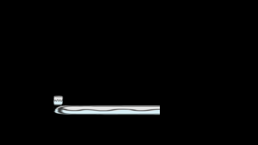

# Artifact

Artifact is a small 2D game engine that's intended to be used just for some personal projects of mine, but ended up being used in some class work years ago. It's largely stale, but has some thoughts about being tied back int other projects like [ArtifactVK](https://github.com/Athosvk/ArtifactVK), [ArtifactRT](https://github.com/Athosvk/ArtifactRT) and [ArtifactSSE](https://github.com/Athosvk/ArtifactSSE). 

## Features

- 2D rendering based on an OpenGL backend. On 10-year old hardware it could render up to [100k sprites at ~60 FPS ](https://athosvkralingen.wordpress.com/2015/12/22/moar-sprites/).
- Text rendering through SDL ttf.
- Audio through SDL mixer.
- 2D physics through Box2D.
- ECS for organizing data and performing communication between systems. [See post](https://athosvkralingen.wordpress.com/2016/01/28/ecs-a-tour-through-the-architecture/).
- ECS performance tests included
- Sample project for experimenting with physics

Also check out [Pong](https://github.com/Athosvk/Pong) and [Arise](https://github.com/Athosvk/Arise) which were built with Artifact.

## Running PhysicsTest

- Build the app through Visual Studio
- Copy over all DLLs from the dependencies directory

